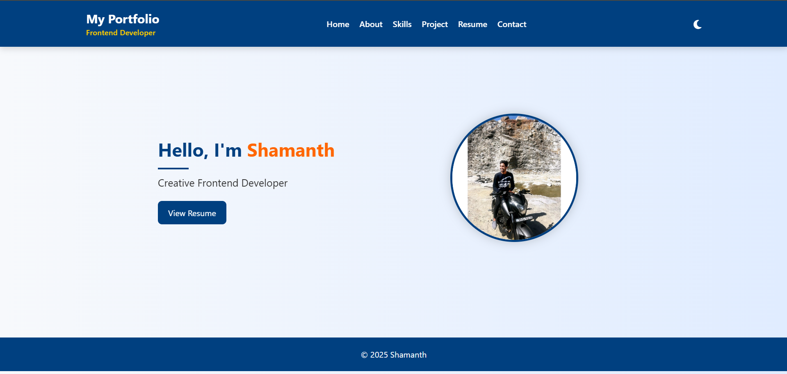
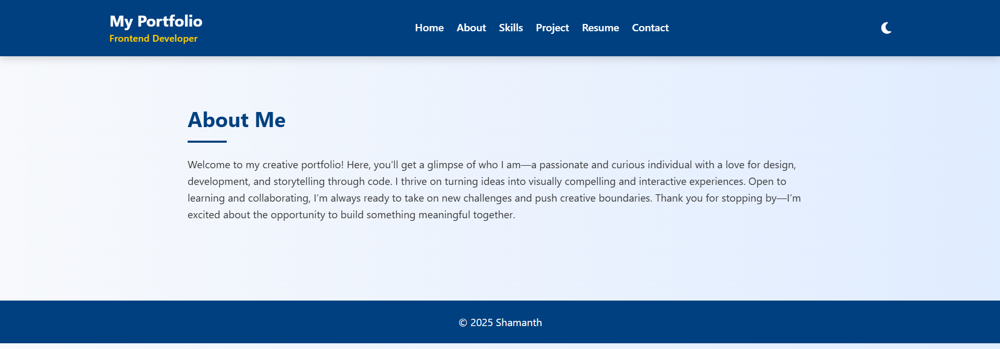
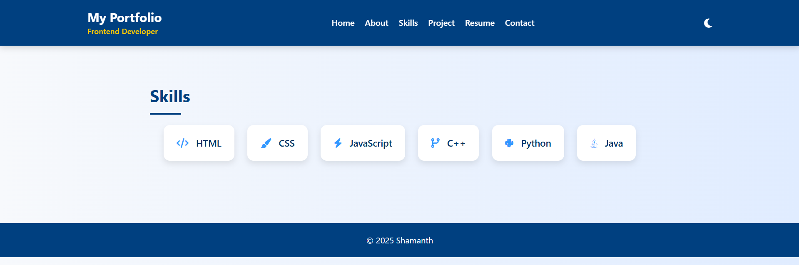
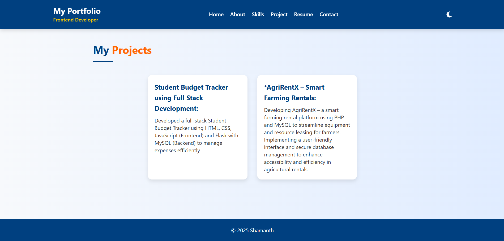
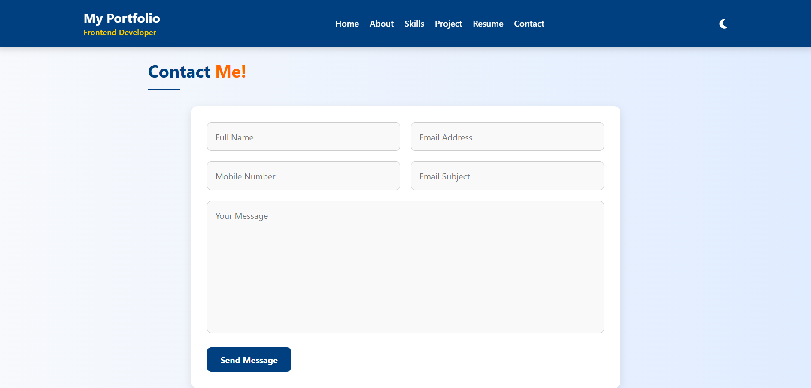

# 💼 Personal Portfolio Website

Welcome to my personal portfolio website! This project showcases my skills, background, and creative work in a modern, responsive, and interactive design.

---

## 📸 Images

### 🏠 Home Page

### 👤 About Page

### 🛠️ Skills Page

### 📂 Projects Page

### 📞 Contact Page

---

## 🧾 Features

- Responsive design
- Dark/Light theme toggle
- Animated home, about, and skills sections
- Clean UI cards for projects
- Contact form with email action

---

## 🗂 Folder Structure

📁 MyPortfolio/
├── home.html
├── about.html
├── contact.html
├── project.html
├── skills.html
├── index.html
├── README.md
├── css/
│   └── style.css
├── assets/
│   ├── profile.jpeg
│   ├── resume.pdf
│   └── screenshots/
│       ├── home.png
│       ├── about.png
│       ├── skills.png
│       ├── projects.png
│       └── contact.png

---

## 📬 Contact

If you'd like to connect or collaborate, feel free to reach out through the [Contact](contact.html) page!

---

> Designed and developed by [Shamanth Patil]

